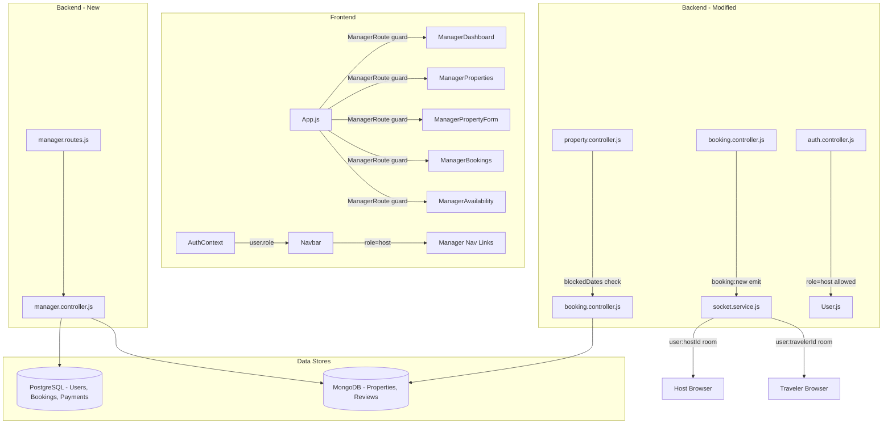
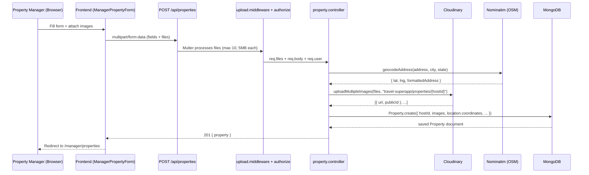
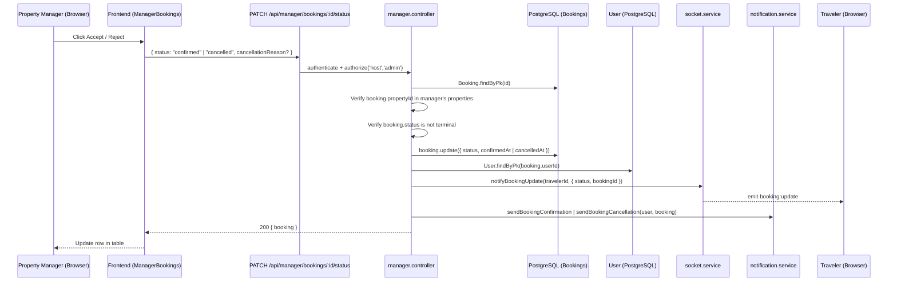
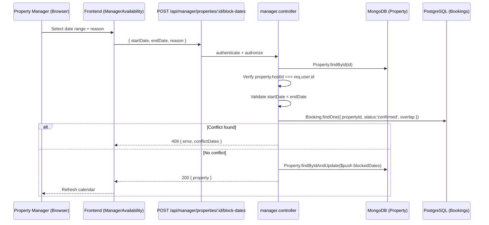
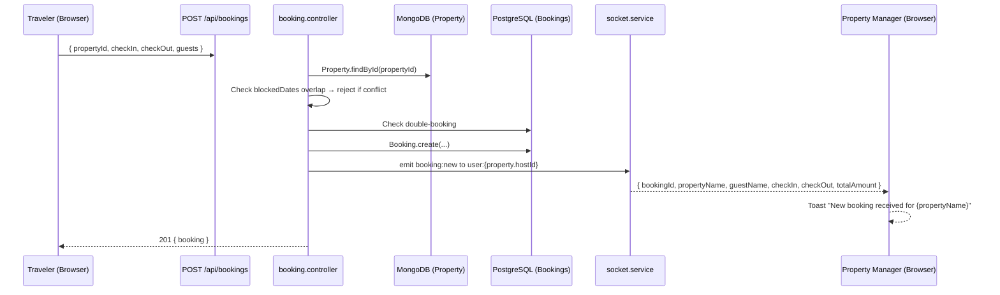

# Design Document: Property Manager Role

## Overview

This document describes the technical design for the Property Manager role feature in the Travel Super App. The feature adds a complete host-side experience on top of the existing traveler-focused platform, enabling users with `role = 'host'` to list properties, manage bookings, block availability, and monitor earnings — all without any PostgreSQL schema migration.

The design follows all existing patterns: Sequelize (PostgreSQL) for transactional data, Mongoose (MongoDB) for property documents, JWT + `authorize()` middleware for RBAC, Cloudinary for images, Socket.io for real-time events, and React lazy-loaded pages with `AuthContext` for role-driven rendering.

---

## Architecture

The feature introduces one new backend module (`manager.controller.js` + `manager.routes.js`) and five new frontend pages, while making targeted modifications to four existing files. No new databases, services, or infrastructure are required.



### Key Architectural Decisions

1. **No new database tables or collections** — `role = 'host'` already exists in the `users` ENUM. The only schema change is adding `blockedDates` to the MongoDB `Property` document.
2. **Separate manager routes** — All manager-specific endpoints live under `/api/manager/*` with `authorize('host', 'admin')` applied at the router level, keeping existing traveler routes unchanged.
3. **Cross-DB joins in the controller** — The manager controller fetches property IDs from MongoDB, then queries PostgreSQL bookings by those IDs. This mirrors the existing pattern in `booking.controller.js`.
4. **Socket room naming** — Manager notifications use the existing `user:{userId}` room pattern from `socket.service.js`. No new room types needed.

---

## Components and Interfaces

### Backend: New Files

#### `backend/controllers/manager.controller.js`

Exports the following named functions + validation arrays:

| Function | Method + Path | Description |
|---|---|---|
| `getDashboard` | `GET /api/manager/dashboard` | Aggregated stats for the authenticated manager |
| `getManagerProperties` | `GET /api/manager/properties` | All properties owned by the manager |
| `getManagerBookings` | `GET /api/manager/bookings` | All bookings for the manager's properties |
| `updateBookingStatus` | `PATCH /api/manager/bookings/:id/status` | Accept or reject a booking |
| `blockDates` | `POST /api/manager/properties/:id/block-dates` | Add a blocked date range |
| `unblockDates` | `DELETE /api/manager/properties/:id/block-dates/:blockId` | Remove a blocked date range |
| `blockDatesValidation` | — | express-validator rules for blockDates |
| `updateBookingStatusValidation` | — | express-validator rules for updateBookingStatus |

#### `backend/routes/manager.routes.js`

```
GET    /api/manager/dashboard
GET    /api/manager/properties
GET    /api/manager/bookings
PATCH  /api/manager/bookings/:id/status
POST   /api/manager/properties/:id/block-dates
DELETE /api/manager/properties/:id/block-dates/:blockId
```

All routes apply `authenticate` then `authorize('host', 'admin')` at the router level.

### Backend: Modified Files

#### `backend/models/Property.js`
Add `blockedDates` subdocument array (see Data Models section).

#### `backend/controllers/booking.controller.js` — `createBooking`
After the existing double-booking check, add a `blockedDates` overlap check against the property document.

After `Booking.create(...)`, emit `booking:new` to the property manager's socket room.

#### `backend/server.js`
Mount the new manager routes:
```js
const managerRoutes = require('./routes/manager.routes');
app.use('/api/manager', managerRoutes);
```

#### `backend/controllers/auth.controller.js` — `register`
The `allowedRoles` array already includes `'host'`. No logic change needed — the existing code already handles this correctly. The only addition is a validation rule to explicitly reject roles outside `['traveler', 'host']` with HTTP 400 (currently it silently defaults to `'traveler'`).

### Frontend: New Files

| File | Route | Description |
|---|---|---|
| `pages/manager/ManagerDashboard.js` | `/manager/dashboard` | Stats cards + recent bookings table |
| `pages/manager/ManagerProperties.js` | `/manager/properties` | Property list with Edit/Delete |
| `pages/manager/ManagerPropertyForm.js` | `/manager/properties/new`, `/manager/properties/:id/edit` | Create/edit form |
| `pages/manager/ManagerBookings.js` | `/manager/bookings` | Booking table with Accept/Reject |
| `pages/manager/ManagerAvailability.js` | `/manager/availability` | Calendar + block-date form |
| `components/manager/ManagerRoute.js` | — | Route guard: redirects non-host to `/` |
| `styles/manager-dashboard.css` | — | Styles for all manager pages |

### Frontend: Modified Files

#### `frontend/src/App.js`
- Import `ManagerRoute` guard
- Add 6 new lazy-loaded routes under `/manager/*`

#### `frontend/src/components/layout/Navbar.js`
- Add conditional manager nav links when `user.role === 'host'`

---

## Data Models

### MongoDB: `Property` — `blockedDates` addition

```js
const blockedDateSchema = new mongoose.Schema({
  startDate: { type: Date, required: true },
  endDate:   { type: Date, required: true },
  reason:    { type: String, default: '' },
}, { _id: true }); // _id: true so each block has a unique ID for deletion
```

Added to `propertySchema`:
```js
blockedDates: {
  type: [blockedDateSchema],
  default: [],
},
```

The `_id: true` on the subdocument is critical — it gives each blocked range a MongoDB ObjectId that the `DELETE /block-dates/:blockId` endpoint uses to pull the specific entry.

### PostgreSQL: No changes

The `Booking` model already has `confirmedAt` and `cancelledAt` fields. The `User` model already has `role ENUM('traveler','host','admin')`. No migrations needed.

---

## API Contract

### `GET /api/manager/dashboard`

**Auth:** `authenticate` + `authorize('host', 'admin')`

**Response 200:**
```json
{
  "data": {
    "totalProperties": 3,
    "activeBookings": 5,
    "completedBookings": 12,
    "totalEarnings": 145000.00,
    "monthlyEarnings": 28500.00,
    "recentBookings": [
      {
        "id": "uuid",
        "propertyName": "Cozy Cottage",
        "guestName": "Jane Doe",
        "checkIn": "2025-08-01",
        "checkOut": "2025-08-05",
        "totalAmount": 12000.00,
        "status": "confirmed",
        "createdAt": "2025-07-20T10:00:00Z"
      }
    ]
  }
}
```

---

### `GET /api/manager/properties`

**Auth:** `authenticate` + `authorize('host', 'admin')`

**Response 200:**
```json
{
  "data": {
    "properties": [ /* Property documents */ ],
    "total": 3
  }
}
```

---

### `GET /api/manager/bookings`

**Auth:** `authenticate` + `authorize('host', 'admin')`

**Query params:** `status`, `page` (default 1), `limit` (default 10)

**Response 200:**
```json
{
  "data": {
    "bookings": [
      {
        "id": "uuid",
        "guestName": "Jane Doe",
        "guestEmail": "jane@example.com",
        "propertyName": "Cozy Cottage",
        "checkIn": "2025-08-01",
        "checkOut": "2025-08-05",
        "guests": 2,
        "totalAmount": 12000.00,
        "status": "pending"
      }
    ],
    "pagination": {
      "total": 25,
      "page": 1,
      "limit": 10,
      "pages": 3
    }
  }
}
```

---

### `PATCH /api/manager/bookings/:id/status`

**Auth:** `authenticate` + `authorize('host', 'admin')`

**Request body:**
```json
{
  "status": "confirmed",
  "cancellationReason": "optional, required when status=cancelled"
}
```

**Response 200:**
```json
{ "data": { "booking": { /* updated Booking */ } } }
```

**Error responses:**
- `400` — terminal state transition attempted
- `403` — booking does not belong to manager's property
- `404` — booking not found

---

### `POST /api/manager/properties/:id/block-dates`

**Auth:** `authenticate` + `authorize('host', 'admin')`

**Request body:**
```json
{
  "startDate": "2025-09-01",
  "endDate": "2025-09-07",
  "reason": "Personal use"
}
```

**Response 200:**
```json
{ "data": { "property": { /* updated Property with blockedDates */ } } }
```

**Error responses:**
- `400` — `startDate` not before `endDate`
- `403` — property not owned by manager
- `404` — property not found
- `409` — overlaps with confirmed booking (includes conflicting booking dates)

---

### `DELETE /api/manager/properties/:id/block-dates/:blockId`

**Auth:** `authenticate` + `authorize('host', 'admin')`

**Response 200:**
```json
{ "data": { "message": "Date block removed successfully" } }
```

**Error responses:**
- `403` — property not owned by manager
- `404` — property or block not found

---

## Data Flow Diagrams

### Flow 1: Property Creation



### Flow 2: Booking Accept/Reject



### Flow 3: Availability Blocking



### Flow 4: New Booking → Manager Notification



---

## Component Hierarchy

```
App.js
├── ManagerRoute (guard component)
│   ├── ManagerDashboard
│   │   ├── DashboardStatCard (×4: properties, active bookings, total earnings, monthly earnings)
│   │   └── RecentBookingsTable
│   ├── ManagerProperties
│   │   ├── PropertyCard (reuses existing) + Edit/Delete buttons
│   │   └── ConfirmDeleteDialog
│   ├── ManagerPropertyForm (create + edit mode)
│   │   ├── BasicInfoSection (title, description, type)
│   │   ├── PricingSection (pricePerNight, fees, discounts)
│   │   ├── LocationSection (address fields + geocode preview)
│   │   ├── AmenitiesSection (checkbox grid)
│   │   ├── HouseRulesSection
│   │   └── ImageUploadSection (drag-drop, max 10)
│   ├── ManagerBookings
│   │   ├── BookingFilters (status dropdown)
│   │   ├── BookingTable
│   │   │   └── BookingRow (Accept/Reject buttons on pending)
│   │   └── Pagination (reuses existing)
│   └── ManagerAvailability
│       ├── PropertySelector (dropdown of manager's properties)
│       ├── AvailabilityCalendar (shows bookings + blocked ranges)
│       └── BlockDateForm (startDate, endDate, reason)
```

---

## Real-Time Event Design

### New Socket Events

#### `booking:new` — emitted to `user:{hostId}`

Triggered in `booking.controller.js` after `Booking.create()` succeeds.

```js
io.to(`user:${property.hostId}`).emit('booking:new', {
  bookingId: booking.id,
  propertyName: booking.propertyName,
  guestName: `${traveler.firstName} ${traveler.lastName}`,
  checkIn: booking.checkIn,
  checkOut: booking.checkOut,
  totalAmount: booking.totalAmount,
});
```

#### `booking:cancelled` — emitted to `user:{hostId}`

Triggered in `booking.controller.js` when a traveler cancels (existing `cancelBooking` function).

```js
io.to(`user:${property.hostId}`).emit('booking:cancelled', {
  bookingId: booking.id,
  propertyName: booking.propertyName,
});
```

#### `booking:update` — emitted to `user:{travelerId}` (existing)

Already emitted by `notifyBookingUpdate()`. The manager controller calls this after accepting/rejecting a booking.

### Frontend Socket Listeners (ManagerDashboard)

```js
useEffect(() => {
  socket.on('booking:new', (data) => {
    setStats(prev => ({ ...prev, activeBookings: prev.activeBookings + 1 }));
    toast.success(`New booking received for ${data.propertyName}`);
  });
  socket.on('booking:cancelled', () => {
    setStats(prev => ({ ...prev, activeBookings: Math.max(0, prev.activeBookings - 1) }));
  });
  return () => {
    socket.off('booking:new');
    socket.off('booking:cancelled');
  };
}, []);
```

---

## Correctness Properties

*A property is a characteristic or behavior that should hold true across all valid executions of a system — essentially, a formal statement about what the system should do. Properties serve as the bridge between human-readable specifications and machine-verifiable correctness guarantees.*

### Property Reflection

Before listing properties, redundancies were eliminated:

- Requirements 1.6 and 1.7 (host nav shown/hidden) are two sides of the same role-conditional rendering property → combined into **Property 2**.
- Requirements 2.5, 3.5, 5.6, 6.3 all test the same ownership authorization invariant → consolidated into **Property 6**.
- Requirements 2.9, 3.1, 6.5 all test data isolation per manager → consolidated into **Property 7**.
- Requirements 1.2 and 6.1 both test JWT role claim inclusion → consolidated into **Property 1**.
- Requirements 3.7 and 3.8 (socket + notification on status change) are both "side effects of status change" → kept separate as they test different subsystems.
- Requirements 4.8 and 6.4 (ManagerRoute guard) are identical → consolidated into **Property 9**.

---

### Property 1: JWT always carries the correct role claim

*For any* user with any valid role, after a successful login the decoded JWT payload SHALL contain a `role` field equal to that user's role in the database.

**Validates: Requirements 1.2, 6.1**

---

### Property 2: Navbar renders manager links if and only if the user is a host

*For any* authenticated user object, the Navbar SHALL render the manager navigation links (Dashboard, My Properties, Bookings, Availability) if and only if `user.role === 'host'`.

**Validates: Requirements 1.6, 1.7**

---

### Property 3: Invalid registration roles are rejected

*For any* string value submitted as `role` that is not `"traveler"` or `"host"`, the registration endpoint SHALL respond with HTTP 400.

**Validates: Requirements 1.5**

---

### Property 4: Property creation sets hostId to the authenticated user

*For any* valid property creation payload submitted by an authenticated host user, the created Property document SHALL have `hostId` equal to the authenticated user's UUID.

**Validates: Requirements 2.1**

---

### Property 5: Image upload stores url and publicId for every file

*For any* set of image files submitted with a property creation or update request, the resulting Property document's `images` array SHALL contain one entry per file, each with a non-empty `url` and `publicId`, and the first entry SHALL have `isPrimary = true` when no prior primary image exists.

**Validates: Requirements 2.2, 7.6**

---

### Property 6: Non-owner managers cannot modify resources they do not own

*For any* request to modify or delete a Property or Booking where the authenticated user's `id` does not match the resource's owner identifier (`hostId` or `booking.propertyId` owner), the service SHALL respond with HTTP 403.

**Validates: Requirements 2.5, 3.5, 5.6, 6.3**

---

### Property 7: Manager endpoints return only the authenticated manager's data

*For any* authenticated manager, every response from `/api/manager/*` endpoints SHALL contain only Properties where `hostId` equals the manager's UUID and only Bookings whose `propertyId` belongs to one of those Properties.

**Validates: Requirements 2.9, 3.1, 6.5**

---

### Property 8: Booking status transitions respect the state machine

*For any* Booking in a terminal state (`completed`, `cancelled`, `refunded`), a status update request SHALL be rejected with HTTP 400. *For any* Booking in a non-terminal state (`pending`, `confirmed`), a valid status update SHALL set the new status and the corresponding timestamp (`confirmedAt` or `cancelledAt`).

**Validates: Requirements 3.3, 3.4, 3.6**

---

### Property 9: ManagerRoute redirects all non-host users

*For any* user whose `role` is not `"host"` (including unauthenticated users and travelers), navigating to any `/manager/*` route SHALL result in a redirect — unauthenticated users to `/login`, travelers to `/`.

**Validates: Requirements 4.8, 6.4, 9.9**

---

### Property 10: Dashboard stats are computed correctly from live data

*For any* set of Properties and Bookings belonging to a manager, the dashboard response SHALL satisfy: `totalProperties` = count of active properties, `activeBookings` = count of pending+confirmed bookings, `totalEarnings` = sum of `totalAmount` for completed bookings, `monthlyEarnings` = sum of `totalAmount` for completed bookings with `confirmedAt` in the current calendar month.

**Validates: Requirements 4.1, 4.2, 4.3, 4.4, 4.5**

---

### Property 11: Blocked dates are appended and removable

*For any* valid date range submitted to `POST /api/manager/properties/:id/block-dates`, the range SHALL appear in the Property's `blockedDates` array. *For any* existing blocked date entry, submitting `DELETE /api/manager/properties/:id/block-dates/:blockId` SHALL remove exactly that entry and leave all others unchanged.

**Validates: Requirements 5.2, 5.5**

---

### Property 12: Blocked date conflicts prevent new bookings

*For any* booking creation request where the `checkIn`–`checkOut` range overlaps with any entry in the target Property's `blockedDates` array, the Booking_Service SHALL reject the request with HTTP 409.

**Validates: Requirements 5.8**

---

### Property 13: Blocked date ranges cannot overlap confirmed bookings

*For any* date range submitted to block-dates that overlaps with an existing `confirmed` Booking for the same property, the Manager_Dashboard_Service SHALL reject the request with HTTP 409.

**Validates: Requirements 5.4**

---

### Property 14: Manager routes reject non-host/non-admin users

*For any* request to any `/api/manager/*` endpoint made by a user whose `role` is not `"host"` or `"admin"`, the RBAC middleware SHALL respond with HTTP 403 before the controller executes.

**Validates: Requirements 6.2**

---

### Property 15: booking:new is emitted to the property manager on every new booking

*For any* successful booking creation, the Socket_Service SHALL emit a `booking:new` event to the room `user:{property.hostId}` containing `bookingId`, `propertyName`, `guestName`, `checkIn`, `checkOut`, and `totalAmount`.

**Validates: Requirements 8.1**

---

## Error Handling

### Backend

| Scenario | HTTP Status | Response shape |
|---|---|---|
| JWT missing or malformed | 401 | `{ error: "..." }` |
| JWT valid but role not host/admin on manager routes | 403 | `{ error: "Access denied. Required role: host or admin" }` |
| Resource not owned by requesting manager | 403 | `{ error: "Not authorized to modify this resource" }` |
| Property/Booking not found | 404 | `{ error: "..." }` |
| Terminal state transition | 400 | `{ error: "Cannot update a booking with status: completed" }` |
| startDate >= endDate | 400 | `{ error: "startDate must be before endDate" }` |
| Block-dates overlaps confirmed booking | 409 | `{ error: "...", conflictDates: { checkIn, checkOut } }` |
| Booking dates overlap blockedDates | 409 | `{ error: "Selected dates are blocked by the property manager" }` |
| Cloudinary upload failure | 500 | `{ error: "Image upload failed. Please try again." }` |
| Deactivated account | 403 | `{ error: "Account has been deactivated." }` (existing middleware) |

All errors follow the existing `{ error, details? }` shape. The manager controller uses `next(error)` for unexpected errors, which the global error handler in `server.js` catches.

### Frontend

- API errors are caught in `try/catch` blocks and displayed via `react-hot-toast` (already used throughout the app).
- `ManagerRoute` handles auth/role redirects before any page renders.
- Form validation uses controlled inputs with inline error messages, consistent with existing `Login.js` / `Register.js` patterns.
- Socket disconnection is handled gracefully — the dashboard falls back to polling or shows a "reconnecting" indicator.

---

## Testing Strategy

### Unit Tests

Focus on specific examples, edge cases, and error conditions:

- `manager.controller.js` — test each function with mocked Sequelize/Mongoose calls
- `Property.js` model — test `blockedDates` subdocument schema validation
- `ManagerRoute` component — test redirect behavior for each role
- `ManagerDashboard` — test stat card rendering with mock data
- Edge cases: zero images, 11 images (over limit), startDate = endDate, terminal state transitions

### Property-Based Tests

Property-based testing is appropriate for this feature because it contains pure business logic functions (stat computation, date overlap detection, ownership checks, JWT claim inclusion) with large input spaces where edge cases matter.

**Library:** [fast-check](https://github.com/dubzzz/fast-check) (JavaScript, works with Jest)

**Configuration:** Minimum 100 runs per property test.

**Tag format:** `// Feature: property-manager-role, Property {N}: {property_text}`

Each correctness property maps to one property-based test:

| Property | Test focus | Generators |
|---|---|---|
| P1: JWT role claim | `generateToken()` output | Arbitrary user objects with role in ENUM |
| P2: Navbar role rendering | React render output | Arbitrary user objects with any role |
| P3: Invalid role rejection | `register()` response | Arbitrary strings excluding "traveler"/"host" |
| P4: hostId on creation | `createProperty()` result | Arbitrary valid property payloads |
| P5: Image url+publicId stored | `createProperty()` images array | Arbitrary arrays of 1–10 mock file objects |
| P6: Ownership 403 | Controller responses | Arbitrary user IDs != resource owner |
| P7: Data isolation | Manager endpoint responses | Multiple managers with interleaved properties/bookings |
| P8: State machine | `updateBookingStatus()` | Arbitrary bookings in each status |
| P9: ManagerRoute redirect | React render + navigate | Arbitrary user objects with any role |
| P10: Dashboard stats | `getDashboard()` computation | Arbitrary arrays of properties and bookings |
| P11: Block/unblock round-trip | `blockedDates` array state | Arbitrary valid date ranges |
| P12: Blocked dates prevent booking | `createBooking()` response | Arbitrary blocked ranges + overlapping booking requests |
| P13: Block conflicts with confirmed | `blockDates()` response | Arbitrary confirmed bookings + overlapping block requests |
| P14: RBAC on manager routes | Middleware response | Arbitrary users with roles != host/admin |
| P15: booking:new socket emit | Socket mock call args | Arbitrary booking creation payloads |

### Integration Tests

- End-to-end: register as host → create property → traveler books → manager accepts → verify all state changes
- Cloudinary upload: verify actual folder path in Cloudinary (1–2 examples, not PBT)
- Socket.io: verify events reach the correct rooms using a test socket client
